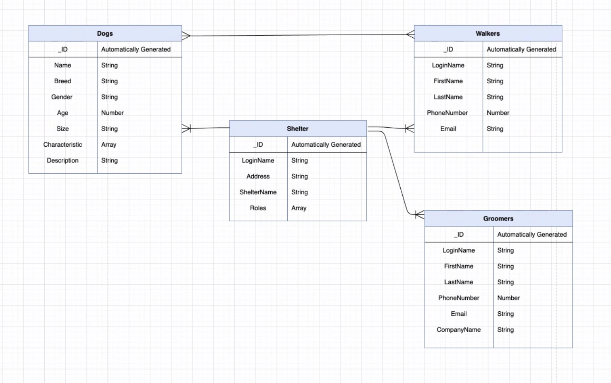

# title page

- logo
- single high def photo, or slideshow (slideshow may be better in home?)
- scroll down type

# nav bar (global)

## Home icon (left side logo)

- takes you to home page (if not signed in)

## drop down menu

- valunteer
- community guidlines
- policy
- settings
- light/dark mode selector

## user

- user profile
- login/ signup.
- takes you to login/signup page (directs you to user profile)

## logout

- logs you out (redirects home)

## about

- dogs
- about company
- about developers

---

# database

## add additional notes here
